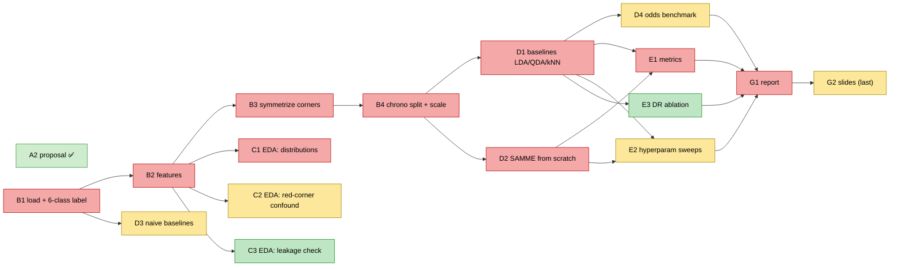

# TODO - Luka & Milica

Task list for the team. Legend: **[ ]** open · **[x]** done · **[?]** decision needed (either/or) · **→ depends on** another task.
Owners + priorities are in the Assignments table below. Background/why for most items is in [CLAUDE.md](../CLAUDE.md) and [DATASETS.md](DATASETS.md).

---

## Decisions - LOCKED (TA approved 2026-06-25)
- [x] **Target:** one **joint 6-class** model (winner × method). (TA: cascade has complications the course didn't cover.)
- [x] **Extension:** **SAMME** (TA preference).
- [x] **Baselines:** **LDA, QDA, kNN** (TA: 1-3, with justification → folded into report Section 5.1).
- [x] **Weird outcomes:** **dropped** (rare, not meaningfully predictable; explained in the report).
- [x] **Split:** chronological ~80/20. **Logistic regression:** not used (enough baselines).
- ⚠️ **Deadline = tomorrow; no late commits accepted.** Out of scope (TA: nothing beyond the proposal): nationality scrape, fight-metric regression.

## Task sequence (dependency graph)

Issues are [#1–#18](https://github.com/lcubrilo/PRML-Projekat/issues). Arrows = "must finish before". GitHub renders the diagram below.

Node colour = priority: red P0 critical, yellow P1 important, green P2 nice-to-have (matches the GitHub labels). Green check = done.

Critical path (all P0): B1 -> B2 -> B3 -> B4 -> D1/D2 -> E1 -> G1.
EDA (C1-C3), D3 (naive), and D4 (odds) hang off earlier nodes and can run in parallel.

### Execution segments (who waits on whom)

The pipeline **B1→B2→B4 is Milica's and B2 gates almost all of Luka's work**. The only big task with no data dependency is **D2 (SAMME)** — Luka builds it against iris/synthetic data while Milica clears the pipeline. Late on, **E1/E2 need both D1 and D2 (both Luka's)**, so the wait flips: Milica waits on Luka there.

| Segment | Milica | Luka | 🔁 Sync gate |
|---|---|---|---|
| **1** parallel | B1 → B2 | D2 SAMME (synthetic data) | **B2 done** → unblocks all EDA + B3/B4 |
| **2** after B2 | B3 → B4; D3 anytime | C1/C2/C3 EDA; finish D2 | **B4 done** → unblocks D1 |
| **3** after B4 | E3 ablation; start report-factual | D1 baselines → D4 odds | **D1 *and* D2 done** → unblocks E1/E2 |
| **4** eval | E2 sweeps, E3 | E1 metrics | all eval done → report |
| **5** deliverables | report-factual, G3 README | report-narrative | report done → G2 slides (both) |

**Tightest squeeze = Segment 3:** E1/E2 need both of Luka's D1+D2. Luka should have **D2 functionally done by the B4 gate** so D1 can run the moment B4 lands and Milica isn't left idle.

## Assignments & priorities (live mirror = GitHub issues)
P0 critical · P1 important · P2 nice-to-have. Early tasks are firm; later ones (E/G) are tentative and can be reshuffled.

| Issue | Task | Prio | Owner |
|---|---|---|---|
| [#2](https://github.com/lcubrilo/PRML-Projekat/issues/2) | B1 load + 6-class label | P0 | **Milica** |
| [#3](https://github.com/lcubrilo/PRML-Projekat/issues/3) | B2 features | P0 | **Milica** |
| [#4](https://github.com/lcubrilo/PRML-Projekat/issues/4) | B3 symmetrize | P0 | **Milica** |
| [#5](https://github.com/lcubrilo/PRML-Projekat/issues/5) | B4 split + scale | P0 | **Milica** |
| [#10](https://github.com/lcubrilo/PRML-Projekat/issues/10) | D2 SAMME from scratch | P0 | **Luka** |
| [#6](https://github.com/lcubrilo/PRML-Projekat/issues/6) | C1 EDA distributions | P0 | **Luka** |
| [#13](https://github.com/lcubrilo/PRML-Projekat/issues/13) | E1 metrics | P0 | **Luka** |
| [#9](https://github.com/lcubrilo/PRML-Projekat/issues/9) | D1 run baselines | P0 | **Luka** |
| [#16](https://github.com/lcubrilo/PRML-Projekat/issues/16) | G1 report | P0 | both |
| [#7](https://github.com/lcubrilo/PRML-Projekat/issues/7) | C2 red-corner confound | P1 | Luka |
| [#12](https://github.com/lcubrilo/PRML-Projekat/issues/12) | D4 odds benchmark | P1 | Luka |
| [#14](https://github.com/lcubrilo/PRML-Projekat/issues/14) | E2 hyperparam sweeps | P1 | Milica (tentative) |
| [#11](https://github.com/lcubrilo/PRML-Projekat/issues/11) | D3 naive baselines | P1 | Milica |
| [#17](https://github.com/lcubrilo/PRML-Projekat/issues/17) | G2 slides (last) | P1 | both (tentative) |
| [#8](https://github.com/lcubrilo/PRML-Projekat/issues/8) | C3 leakage check | P2 | Luka |
| [#15](https://github.com/lcubrilo/PRML-Projekat/issues/15) | E3 DR ablation | P2 | Milica (tentative) |
| [#18](https://github.com/lcubrilo/PRML-Projekat/issues/18) | G3 README | P2 | Milica (tentative) |

**Domain-knowledge notes:** Luka knows UFC, Milica is new to it, so interpretation goes to Luka. B2 (#3): Luka shortlists which features matter, Milica implements. Report (#16) is split by domain: Milica writes the factual sections (dataset, setup, baselines), Luka writes the narrative/analysis (intro, problem, EDA, analysis, conclusions) - see `report/report.md`.

## Already done - foundations (not part of the B-G plan below; live status lives in the checkboxes)
- [x] Datasets downloaded + inspected; leakage audited → [DATASETS.md](DATASETS.md). Primary = `mdabbert/ufc-master.csv`.
- [x] All course baseline methods implemented from scratch in `src/baselines/` + validated vs sklearn.
- [x] Repo skeleton, notebook stubs, `requirements.txt`, literature grounding ([SOURCES.md](SOURCES.md)).
- Reusable from-scratch infra built this round is tracked at its own B-G task below (SAMME, metrics, naive baselines, odds benchmark, plotting). Full test suite **44/44** via `tests/validate_baselines.py`.

---

## Build - in dependency order

### A. Send the proposal (do first - affects max marks)
- [x] **A1.** Agree the four open decisions above (at least enough to write the proposal).
- [x] **A2.** Send the proposal email to the TA (draft agreed in chat - not stored in repo). → depends on **A1**.

### B. Data → features  (`src/data/`) - Milica
- [x] **B1.** Loader + 6-class label (`load.py`): drops result/leak cols and weird outcomes. Done.
- [x] **B2.** Feature matrix (`features.py::make_features`): `*_dif` + absolute R_/B_ cols, one-hot stance/weight_class, debut NaNs filled. Done. **Fix pending:** exclude market cols (`R_odds, B_odds, R_ev, B_ev`) - they currently leak into the features.
- [x] **B3.** Symmetrize corners (`features.py::symmetrize`): negate diffs, swap R_/B_, flip label side. Done.
- [ ] **B4.** Chronological split + scale-fit-on-train-only (`split.py`, still a stub). **The one piece that unblocks all modelling.**

### C. EDA  (`notebooks/01_eda.ipynb`) - Luka - unblocked now (B2 is done)
- [ ] **C1.** Distributions, class balance (method + winner), weight-class / stance breakdowns.
- [ ] **C2.** **Red-corner confound analysis** (the differentiator): raw red win-rate → condition on odds/favorite → show colour itself adds little.
- [ ] **C3.** Correlations / feature look; sanity-check leakage (debut rows have empty priors).

### D. Modelling  (`notebooks/02-03`)
- [ ] **D1.** Run baseline panel (LDA, QDA, kNN) on the features. Needs **B4**. (Luka)
- [x] **D2.** SAMME from scratch + tests. Done. (Running on the real split happens with D1 in the notebook.)
- [ ] **D3.** Naive baselines - **classes done** (`src/baselines/naive.py`), just need running on the split. Needs **B4**. (Luka)
- [ ] **D4.** Odds benchmark - **de-vig + `market_benchmark` done** (`src/data/odds.py`), only the model-vs-market comparison remains. Needs **D1**. (Luka)

### E. Evaluation & analysis  (`notebooks/04_results`)  → depends on D
- [ ] **E1.** Metrics - **functions done** (`src/metrics.py`: accuracy, F1, ROC-AUC, log-loss, Brier, confusion matrix, seed summary); apply to the baseline + SAMME outputs. Needs D1/D2 runs. (Luka)
- [ ] **E2.** Hyperparameter sweeps + plots - plotting helpers + `staged_score` ready; needs models on data. (Milica)
- [ ] **E3.** Dim-reduction ablation (PCA / LDA-projection) + 2D plot coloured by method. (Milica)

### F. Out of scope (TA: nothing beyond the proposal; deadline tomorrow)
- ~~F1 nationality scrape~~ · ~~F2 fight-metric regression~~ - cut. Don't start these.

### G. Deliverables  → depends on E
- [ ] **G1.** Report - **drafted: Sections 1, 1.1, 2, 5.1, 5.2, 9-future-work, References.** Remaining: 3 dataset, 4 EDA, 6 setup, 7 results, 8 analysis, 9 findings. (both)
- [ ] **G2.** Oral-defense slides. (both)
- [ ] **G3.** README for end users. (Milica)
