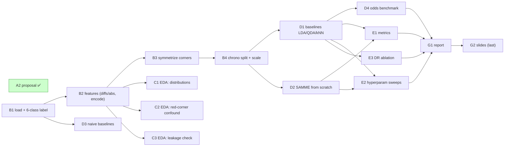

# Task sequence (dependency graph)

Issues are [#1–#18](https://github.com/lcubrilo/PRML-Projekat/issues). Arrows = "must finish before". GitHub renders the diagram below.

Critical path: **B1 → B2 → B3 → B4 → D1/D2 → E1/E2 → G1 → G2**.
EDA (C1–C3), D3 (naive), and D4 (odds) hang off earlier nodes and can run in parallel.
