# Comparative Study of Classical Classifiers and a Multiclass Boosting Extension for Predicting UFC Fight Outcomes (Winner and Method)

*Luka Čubrilo, Milica Cvetić. PMF UNS, Pattern Recognition and Machine Learning*

## 1. Introduction

The Ultimate Fighting Championship (UFC) is the world's largest mixed martial arts (MMA) organization, having hosted thousands of fights between fighters drawn from virtually every country on the planet over the last few decades. From controversial and humble beginnings, it has grown into one of the most-watched combat-sports promotions globally, frequently discussed alongside mainstream leagues like the NBA, F1 and FIFA in terms of viewership, popularity and cultural impact.

In its infancy the sport was marked by a notable lack of numbers and statistics relative to data-rich sports like baseball. This gap led Rami Genauer to build one of the first systematic UFC datasets, *FightMetric*, hand-coded across roughly sixty-seven categories and adopted as the UFC's official statistics provider in 2008 [[4]](#ref-4). It is now known as *UFC Stats* (ufcstats.com), and essentially every publicly available UFC dataset is a derivative of it - the one we use included.

In a sport thick with myths and folk wisdom - ring rust, octagon jitters, the reach advantage - having actual numbers finally allowed many such claims to be checked for statistical support, as popularized by book-length statistical treatments of the sport such as *Fightnomics* [[7]](#ref-7). Nonetheless, MMA carries a large factor of inherent randomness: a single clean strike can end a fight at any moment, regardless of who was ahead. Reflecting this, most published analyses of UFC data report winner-prediction accuracy that does not meaningfully exceed the mid-to-high 60s percent [[5]](#ref-5). The strongest single predictor tends to be the betting market itself, which lands around 65% [[5]](#ref-5). We did find one model reporting as high as 79% [[6]](#ref-6), but with strong suspicion of leakage between train and test - a recurring trap we discuss below.

Fundamentally, this means fight outcomes cannot be predicted much better than a well-informed guess. Rather than treat that as a wall, we frame it as a *ceiling*: our goal is to get as close to it as we can, and at the very least to clearly beat a primitive baseline such as "always pick the favourite." We additionally benchmark our model against the actual betting odds - effectively asking whether we can "beat the house," an unlikely but instructive target, since the market is the practical ceiling on how much signal is even extractable.

What distinguishes this study from the many public UFC-prediction projects is less the raw accuracy than the rigour around it. First, we audit for **lookahead leakage** and use only genuinely pre-fight information, so reported numbers are not inflated by information that would be unknown at prediction time. Second, we treat the well-known **red-corner advantage** as a controlled analysis rather than a feature, showing that it is largely a selection effect (the red corner is systematically the favourite) rather than a property of the colour itself. Third, instead of predicting only the winner, we predict the harder **joint outcome of winner and method** (six classes), which is both more interesting and more learnable from stylistic features. Finally, because our dataset ships per-method betting props, we can benchmark this richer target against the market by **log-loss**, not just accuracy.

Our strongest model reaches about 63% winner-prediction accuracy, within the published ceiling and a short step behind the betting market, while the from-scratch boosting extension proves no better than a simple linear discriminant. We read this as the predictive signal in pre-fight data being close to exhausted: getting near the ceiling is the achievable goal, and the rest is the sport's irreducible randomness.

### 1.1 Related work

UFC is a popular subject for data projects, and the public landscape is heavily skewed toward **winner prediction**: logistic regression, random forests and gradient-boosted trees (XGBoost / LightGBM) trained on the same ufcstats lineage, typically landing in the low-to-mid 60s percent [[6]](#ref-6). Method-of-victory is tackled less often but is not unheard of - a handful of comparative studies and applications predict *how* a fight ends as well as *who* wins. A different and, to us, especially interesting strand uses unsupervised learning to **cluster fighters by style**; the most directly comparable example is the 2024 factor-analysis-plus-K-means study [[3]](#ref-3), which groups fighters into stylistic archetypes and links them to outcomes.

We genuinely enjoyed the style-clustering idea and considered it as our own project, but ultimately found *predicting outcomes* more exciting, and we wanted a way to keep the notion of "style" in play rather than discard it. Our compromise is the **joint winner-and-method target**: rather than clustering style directly, we let it surface through *how* fights are won (a grappler's submissions and decisions vs. a striker's knockouts) and through difference features between the two fighters. As a course project we make no claim to novelty against the academic literature - our contribution is a *combination* that is rare in the public pile: everything implemented from scratch, an explicit leakage audit with a chronological split, the red-corner advantage handled as controlled EDA rather than a feature, and a benchmark against the **per-method betting market**, which almost no public project attempts.

## 2. Problem description

We formulate the task as a single **multiclass classification problem over six classes**: the joint outcome of *who wins* (Red or Blue corner) and *how the fight ends* (KO/TKO, submission, or decision) - i.e. `Red-KO`, `Red-SUB`, `Red-DEC`, `Blue-KO`, `Blue-SUB`, `Blue-DEC`. Each fight is described only by information available *before* it starts (pre-fight career aggregates, physical attributes, stance, weight class, and difference features between the two fighters), and the model must assign one of the six labels.

**Why joint rather than a cascade.** An alternative is to predict the outcome in stages - first the winner, then the method, possibly then the round. We deliberately avoid this. A cascade is really three separate models whose errors compound, and its weakest link (round-of-finish) is badly data-starved; our teaching assistant also noted that a staged design pulls in complications the course did not cover. A single six-class model sidesteps all of this: it is one clean classifier, it produces a single interpretable six-way confusion matrix, and it still recovers the winner and the method by marginalizing over the predicted class. The cost - a slightly larger label space - is modest given the dataset size.

**"Whose style wins, and how."** Predicting the *method* is not just extra difficulty for its own sake. Method of victory is more directly tied to fighting style than the bare winner is: a grappling-dominant matchup leans toward submissions and decisions, a high-power striking matchup toward knockouts. Framing the problem around winner *and* method lets the difference features (striking, takedown, control-time differentials between the two fighters) express the kind of stylistic information that a winner-only target tends to wash out, and it makes the confusion matrix genuinely informative about *what the model has learned about fighting*.

**Reference points.** Because raw accuracy is hard to interpret in a high-variance sport, we judge the model against explicit baselines rather than in absolute terms: a coin flip (50%); a naive "always pick the favourite" rule (~58-64%, though, as Section 4 shows, this is inflated by the red-corner selection effect rather than a real colour advantage); and the de-vigged **betting market** (~65%), which we treat as the practical ceiling on extractable signal and compare against by log-loss using the dataset's moneyline and per-method prop odds.

**Excluded outcomes.** Fights ending in ways that fall outside the three method buckets - disqualifications, no-contests, overturned results, draws, and bouts with an unrecorded method - are rare and not meaningfully predictable from pre-fight features. We drop them rather than dilute the label space with a noisy catch-all class; the exact filtering and its effect on dataset size are described in Section 3.

## 3. Dataset description

The dataset is the **mdabbert Ultimate UFC Dataset** (`ufc-master.csv`, Kaggle), itself a derivative of ufcstats.com / FightMetric, which has been the UFC's official statistics provider since 2008. We chose this particular package because it is the only single-file source that combines pre-fight career aggregates, physical attributes, and per-method betting odds - everything needed for both modelling and the market benchmark, without any manual joining across sources.

The dataset covers UFC fights from 2010 to 2026 at one row per bout. Fights with outcomes outside our three method buckets are dropped: disqualifications, no-contests, overturned results, draws, and rows with an unrecorded method. These are rare edge cases that carry no clean signal from pre-fight features. After filtering, **6,911 fights** remain across six joint outcome classes. The two fighters in each fight are anonymized as the Red and Blue corners; each row carries pre-fight career aggregates and physical attributes for both corners, together with pre-computed difference (`_dif`) columns representing the red-minus-blue gap on each statistic. The main feature groups are: physical attributes (height, reach, age, stance, weight class); record (wins, losses, win streak, loss streak); and per-fight career rates (significant strikes landed and absorbed, takedown attempts and accuracy, control time, knockdowns, and submission attempts).

The six-class target is constructed in `src/data/load.py` by combining the `Winner` column (Red or Blue) with the `finish` column mapped to three method buckets: KO/TKO → KO, any decision variant (unanimous, split, or majority) → DEC, and submission → SUB. This yields labels such as `Red-DEC` or `Blue-KO`. All columns that carry information from the fight itself are excluded from the features to prevent lookahead leakage: the winner, the finish method, finish details, the round and time of finish, the total fight duration (this last one is easy to overlook but encodes whether the fight ended early), and the empty-arena indicator. The betting-odds columns (moneyline and per-method props) are retained in the dataset but withheld from the feature matrix; they are used only for the Section 7 market benchmark.

Career-average statistics for a fighter's very first UFC bout are not available by design: there was no prior UFC fight to aggregate over. These debutant rows consequently show approximately 75% missing values in their career-average columns, whereas experienced fighters have complete aggregates with essentially zero missing values. We use this gap as the leakage sanity check described in Section 4. In the modelling pipeline the missing values are filled by median imputation, computed on the training set only and then applied to the test set (see Section 6).

## 4. Exploratory data analysis

The dataset has 6,911 fights after dropping weird outcomes, spread across the six joint classes.

**Class balance.** The classes are imbalanced: `Red-DEC` is the largest (1,974 fights) and `Blue-SUB` the smallest (485), roughly a fourfold spread. Broken down, the winner is Red 57.7% of the time and Blue 42.3%, and the method of victory is decision 49.6%, KO/TKO 32.2%, and submission 18.2%. Because of this imbalance we judge models on per-class and macro F1 and log-loss rather than raw accuracy, which a model could inflate by always predicting a decision. A method-by-weight-class breakdown shows the expected pattern that heavier divisions finish more often by knockout.

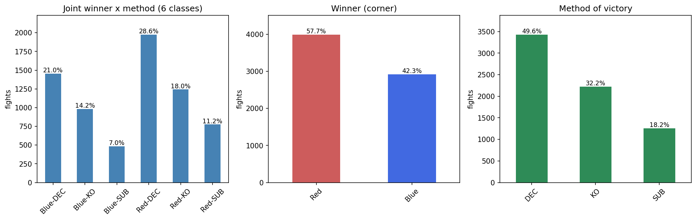

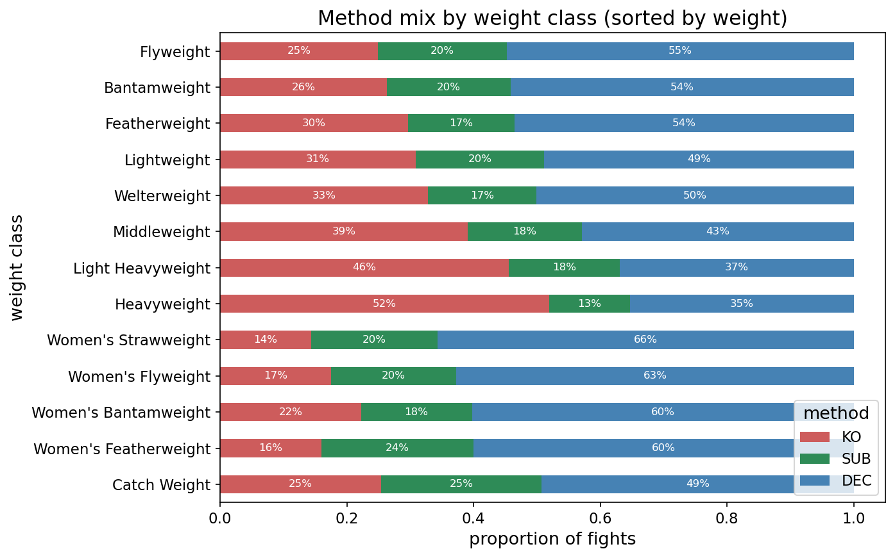

**The red-corner confound.** Red wins 57.7% of fights, which at first looks like a "red advantage." It is not: the red corner is systematically assigned to the favourite (red is the betting favourite in 59.5% of fights). Conditioning on the market makes this clear: red wins 69.6% of the time when it is the favourite but only 40.4% when it is the underdog, while the favourite wins 65.5% of fights regardless of corner. So the corner is a proxy for who the market favours, and the colour itself carries almost no information. This is a selection effect, not a causal one, and it drives two design choices: we **symmetrize the corners** (randomly swap red/blue to a 50/50 base rate) so the models cannot exploit the shortcut, and we measure the naive "always-red" baseline only on the original, un-symmetrized corners.

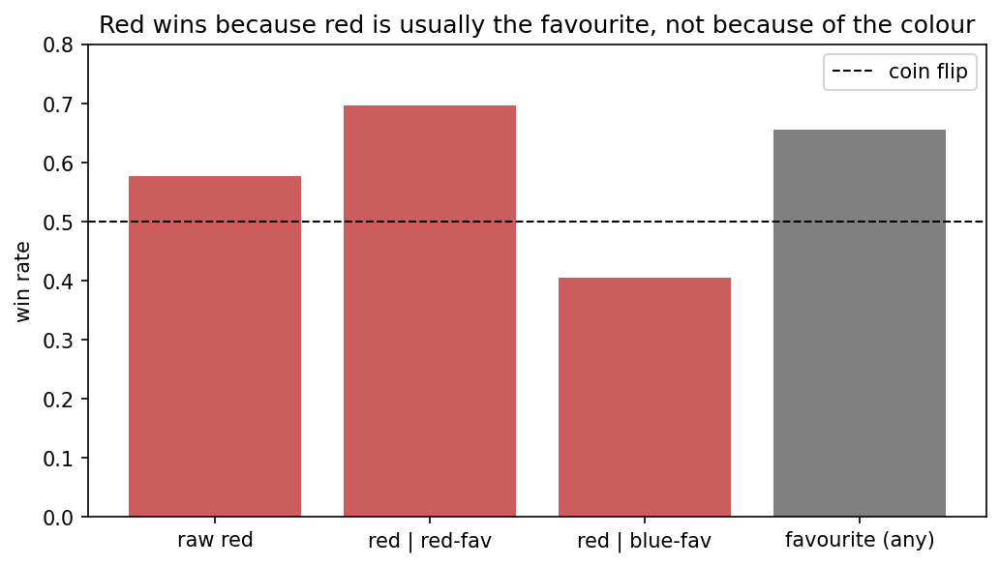

**Feature distributions and correlations.** The difference features (red minus blue) are roughly centred, as expected once corners are balanced. Correlations among them are mostly low, with two intuitive exceptions: reach and height differences correlate at 0.63, and career KO and overall-win differences at 0.63. The features are therefore largely non-redundant, which is reassuring for the covariance-based baselines (LDA and QDA).


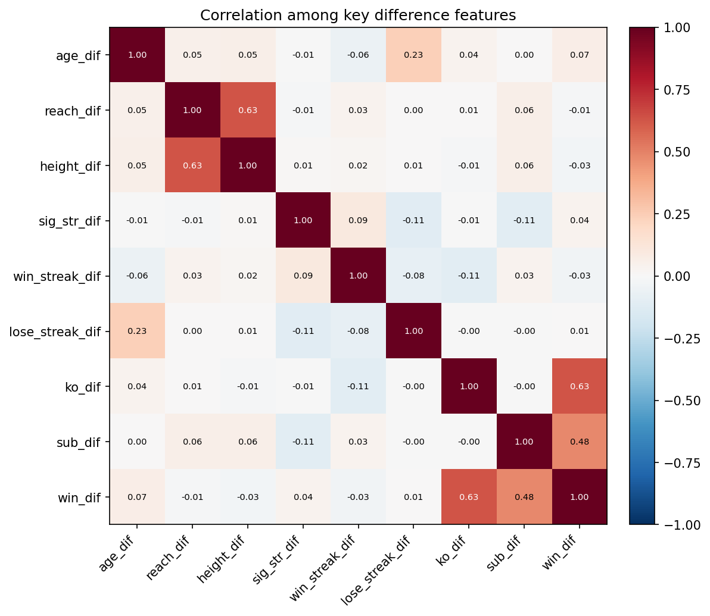

**Which features carry signal.** Ranking the difference features by their absolute correlation with the eventual winner is revealing on two counts. The most predictive sit in three different areas: recent form (win-streak difference, 0.13), grappling (average takedowns, 0.12), and experience (total rounds fought, 0.09), all ahead of striking and physical attributes. Reach (0.05) and especially age (0.005) barely move the needle, which is notable given how often both are invoked in fight analysis. More importantly, every one of these correlations is small (the largest is 0.13): no single pre-fight feature is strongly predictive, which is the first concrete sign that achievable accuracy will be limited.

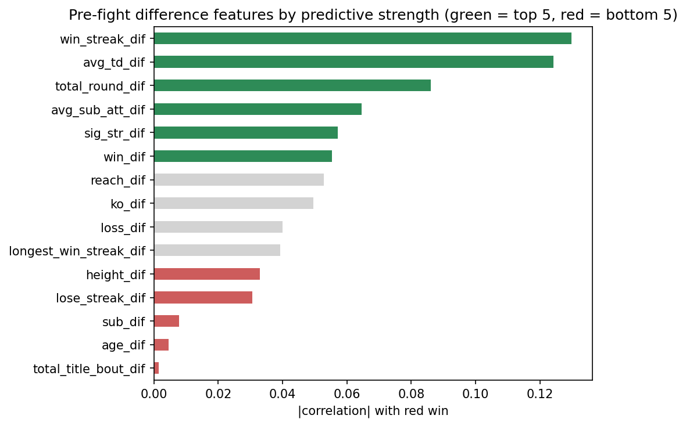

**Leakage sanity check.** Career-aggregate features are only safe if they are computed from a fighter's prior bouts and exclude the one being predicted. We confirm this holds: experienced fighters have complete pre-fight averages (0% missing), whereas debutants (no prior UFC record) have mostly empty priors (~75% missing). If the current bout had leaked into the aggregates, debutants would already show statistics; they do not. The aggregates are genuinely pre-fight, so the row a model sees does not contain its own outcome.

## 5. Methods

### 5.1 Baseline methods (from scratch)

The brief allows one to three baseline methods with a justification of the choice; we use three: LDA, QDA, and kNN. Together they span the three classical decision-boundary families covered in the course, which gives a controlled, low-redundancy comparison rather than three methods that behave alike.

- **LDA** (linear discriminant analysis) assumes one shared covariance across classes, giving linear boundaries. It is the low-variance, higher-bias generative reference, our linear floor.
- **QDA** (quadratic discriminant analysis) gives each class its own covariance, so the boundaries curve. It is the more flexible generative model and the theoretically motivated centrepiece here: the six outcome classes plausibly differ in covariance structure, not just in their means (a knockout-prone matchup and a decision-prone matchup spread differently across striking and grappling statistics), and QDA can capture that where LDA cannot. Placing the two side by side directly tests whether the extra flexibility pays off; if LDA matches QDA, the classes effectively share covariance and the simpler model is preferred.
- **kNN** (k nearest neighbours) is non-parametric and instance-based, making no distributional assumption, so it can win where the Gaussian models fail on non-Gaussian or multimodal class regions. It also exercises two course themes cleanly: feature scaling (being distance-based, it is scaled on the training set only) and a hyperparameter sweep over k.

All three are natively multiclass, so no one-vs-rest workaround is needed on the six-class target. We leave the other covered classifiers out to avoid redundancy: the perceptron and least-squares classifier are inherently binary-linear and add little beyond LDA; Gaussian naive Bayes is essentially QDA with a diagonal covariance; and the Parzen/KDE classifier is density-based and conceptually close to kNN. (k-means, PCA, and linear regression address different tasks; PCA still appears, but separately, as the optional dimensionality-reduction ablation in Section 7, not as a baseline classifier.)

Each baseline is implemented from scratch and validated against scikit-learn (see `tests/`); as with the extension, the library is used only to check correctness, and every reported number comes from our own implementation. This panel of generative-linear (LDA), generative-quadratic (QDA), and instance-based (kNN) methods sets up the project's core question against the boosting extension of Section 5.2: does the more complex ensemble beat the classical baselines, and is the gain worth the added complexity?

### 5.2 Extension (from scratch)

Our extension is SAMME (Stagewise Additive Modeling using a Multi-class Exponential loss), the multiclass generalization of AdaBoost introduced by Zhu, Zou, Rosset and Hastie [[1]](#ref-1), building on the original binary AdaBoost of Freund and Schapire [[2]](#ref-2). We chose it because our target has six classes and classic AdaBoost is binary: SAMME extends boosting to K classes directly, without decomposing the problem into several one-vs-rest models, so the output stays a single vote over all six labels.

**Weak learner.** SAMME boosts an ensemble of deliberately weak classifiers. We use a decision stump, a depth-one tree that splits on one feature at one threshold. Our stump is fit on weighted samples: for every feature it scans the midpoints between sorted unique values, sends each side to its weighted-majority class, and keeps the split with the lowest weighted misclassification. The sample weights are the only channel through which boosting steers the stump from one round to the next.

**Algorithm.** Sample weights start uniform. At each of the T rounds we fit a stump to the weighted data, measure its weighted error `err`, and assign it a vote weight

    alpha = log((1 - err) / err) + log(K - 1)

then multiply the weight of every misclassified sample by `exp(alpha)` and renormalize, so the next stump concentrates on the cases the current ensemble gets wrong. The final prediction is the additive model: for each class we sum the alpha of the stumps that voted for it and take the argmax. Normalizing those per-class vote sums to one gives `predict_proba`, which we need for log-loss and ROC-AUC.

**The multiclass term.** The only difference from binary AdaBoost is the `+ log(K - 1)` added to alpha. With K = 2 it is zero and SAMME reduces exactly to AdaBoost. For K greater than 2 it is what lets a stump that merely beats random guessing (an error below (K-1)/K rather than below one half) still earn a positive vote; we stop adding stumps once a round can no longer clear that bound.

**Validation.** The implementation is from scratch in NumPy. We validate it against scikit-learn's `AdaBoostClassifier(algorithm='SAMME')` with depth-one trees on the Iris dataset, checking both the stump alone and the full ensemble, and we separately confirm that on a two-class problem our SAMME matches binary AdaBoost (the K = 2 case above). All checks pass and are part of the project's test suite. As the brief requires, scikit-learn is used only for this validation; every reported number comes from our own code.

## 6. Experimental setup

**Feature matrix and corner symmetrization.** The feature matrix contains 114 columns: the pre-computed difference (`_dif`) columns from the dataset, the absolute per-corner `R_`/`B_` columns (physical attributes and career rates), two binary debut flags (`R_is_debut`, `B_is_debut`) that preserve the signal that a fighter has no prior UFC record, and one-hot encodings of stance (Red and Blue) and weight class. Betting-odds columns are excluded from the features and used only for the market benchmark. To eliminate the red-corner prior (Section 4), we apply **corner symmetrization** to the training set: each fight is independently assigned a random 50/50 coin flip; a flip consistently negates all `_dif` columns, swaps the paired `R_`/`B_` columns, and flips the label's winner side (e.g. `Red-KO` becomes `Blue-KO`). The test set keeps its original corners so that the always-red reference and the betting market are scored on the same fights as our models.

**Split, scaling, and imputation.** We use a **chronological 80/20 split**: the earlier 80% of fights by date form the training set (5,529 fights) and the later 20% form the test set (1,382 fights). No random shuffling is applied, so the split mirrors a real forecasting scenario in which the model is always trained on the past and evaluated on the future. Standardization (mean 0, standard deviation 1) and median imputation for missing career aggregates are both fit on the training set only and then applied to the test set, preventing any test information from leaking into preprocessing.

**Seeds and evaluation protocol.** Because corner symmetrization involves a random coin flip, the training set varies across runs. All reported metrics are the mean (± standard deviation) over **three symmetrization seeds** (0, 1, 2). The test set is the same for all seeds (original corners, no randomness). Every from-scratch implementation is verified against scikit-learn on a held-out reference dataset before being used for evaluation: LDA, QDA, and kNN are checked on the project data itself, and SAMME is checked on the Iris dataset; the full validation suite (44/44 checks passing) lives in `tests/`. Scikit-learn is used solely for this correctness check; every number reported in Section 7 comes from our own code.

**Metrics and hyperparameter sweeps.** We report 6-class accuracy, winner-collapsed accuracy (Red vs Blue), method-collapsed accuracy (KO/SUB/DEC), macro-F1 (unweighted average over the six per-class F1 scores, so all classes count equally), one-vs-rest macro ROC-AUC, and log-loss, all from `src/metrics.py`. For the probabilistic market comparison we also compute the Brier score. Hyperparameter sweeps cover: SAMME number of stumps (evaluated at every round from 1 to 200 via `staged_score`); kNN number of neighbours k (values 1, 3, 5, 7, 11, 15, 21, 31); and PCA dimension for the dimensionality-reduction ablation (values 2, 5, 10, 20, 30, 50).

## 7. Results

All numbers below are the mean over three symmetrization seeds, on the chronological original-corner test set (1,382 fights; the market benchmark uses the 1,099 with full per-method odds). Models are scored on the full six-class target and, for comparison against the reference baselines, collapsed to the winner (Red/Blue) and the method (KO/SUB/DEC).

All accuracies, macro-F1 and ROC-AUC are over the six-class target (ROC-AUC is one-vs-rest, macro-averaged); winner and method are the collapsed views.

| Model | 6-class acc | winner acc | method acc | macro-F1 | ROC-AUC | log-loss |
|---|---|---|---|---|---|---|
| **SAMME (extension)** | **0.349** | **0.633** | 0.515 | 0.297 | **0.698** | 1.663 |
| LDA | 0.343 | 0.626 | 0.516 | **0.315** | 0.685 | 1.592 |
| QDA (reg) | 0.230 | 0.567 | 0.371 | 0.220 | 0.624 | 3.134 |
| kNN (k=15) | 0.282 | 0.550 | 0.497 | 0.221 | 0.595 | 3.642 |
| majority class | 0.266 | 0.521 | 0.514 | 0.070 | 0.500 | 1.702 |
| always-red (reference) | - | 0.562 | - | - | - | - |
| coin flip (reference) | - | 0.500 | - | - | - | - |
| betting market (reference) | - | - | - | - | - | 1.551 |

Here **macro-F1** is the unweighted average of the six per-class F1 scores (each F1 being the harmonic mean of that class's precision and recall), so every class counts equally and ignoring the rare ones is penalized; **ROC-AUC** (one-vs-rest, macro-averaged) measures how well each class is *ranked* above the rest, where 0.5 is random and 1.0 is perfect. The macro-F1 and ROC-AUC corroborate the headline tie: SAMME has the best ROC-AUC (0.698) and LDA the best macro-F1 (0.315), the two effectively level while QDA, kNN and the majority baseline trail on every column. The low macro-F1 across the board reflects the rare submission classes, which all models recover poorly (see the confusion matrix), and the ROC-AUCs near 0.6-0.7 confirm only modest separability, consistent with a near-ceiling problem.


**The extension ties the best baseline.** SAMME reaches 0.633 winner accuracy and LDA 0.626; the gap is smaller than the seed-to-seed standard deviation (about 0.01-0.02), so the 200-stump ensemble and the single linear discriminant are, for practical purposes, equal. Both land squarely in the published ~63-67% winner-prediction ceiling and clearly beat the always-red baseline (0.562) and a coin flip.

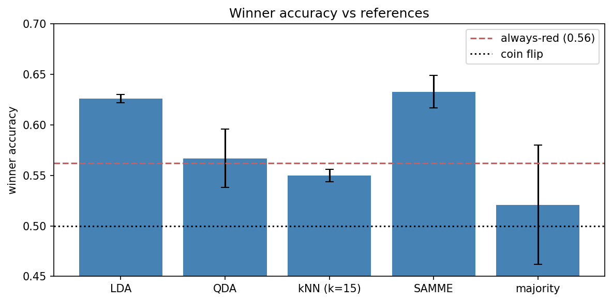

**The flexible and instance-based methods struggle in high dimensions.** QDA (0.567 winner) and kNN (0.550) trail the linear and boosted models, and their log-loss is poor (3.13 and 3.64 against ~1.6 for LDA/SAMME) - QDA stays overconfident even regularized, and kNN suffers the curse of dimensionality at 114 features. This is consistent with the EDA finding that the outcome is roughly linear in the difference features. Whether dimensionality reduction rescues them is the ablation below.

**Convergence and overfitting.** SAMME's test accuracy peaks at around round 113 and drifts slightly down by round 200, so the ensemble mildly overfits past its sweet spot - a textbook boosting curve.

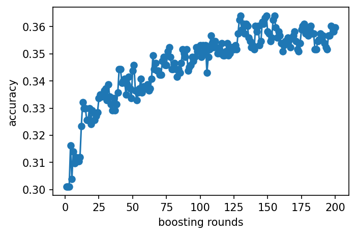

The confusion matrices tell the same story for the extension and the best baseline: predictions concentrate on the two common decision classes (Red-DEC and Blue-DEC), so knockouts and especially submissions are recovered far less often. SAMME, for instance, recovers Red-DEC outcomes 51% of the time but Blue-SUB only 14%.

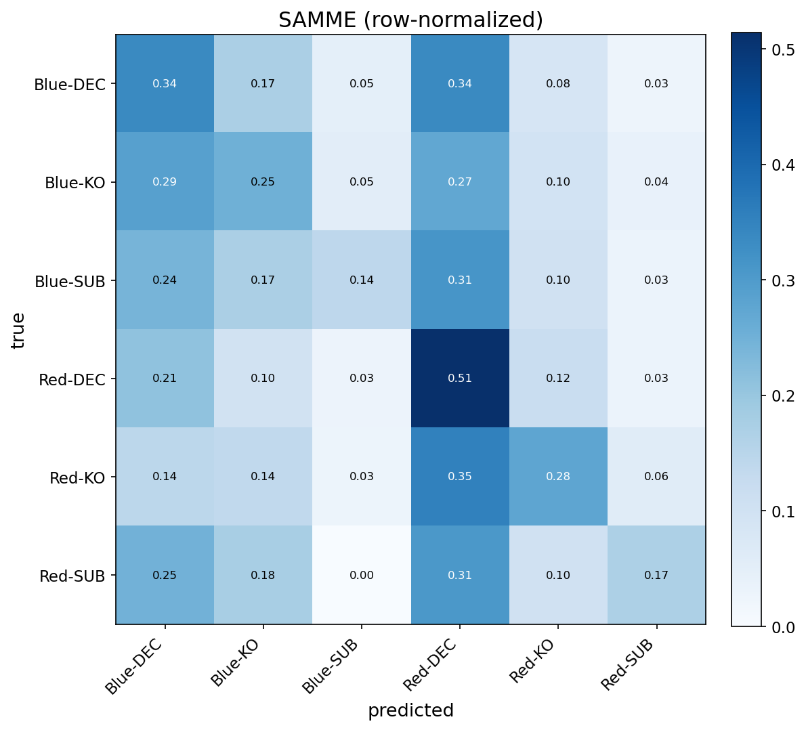

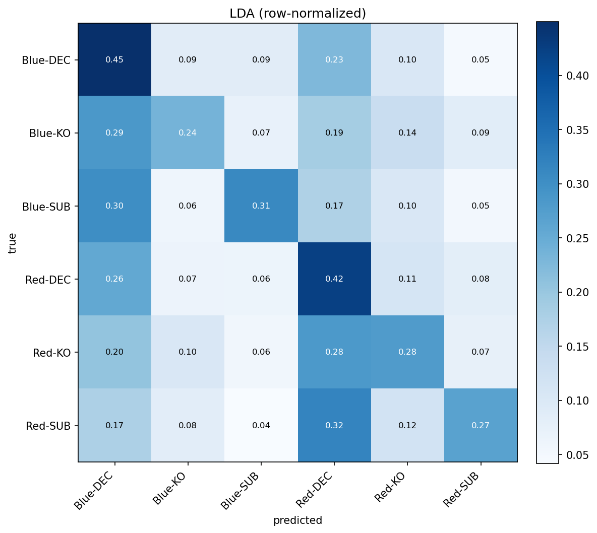

**Against the market.** Scored by log-loss on the 1,099 fights with full odds coverage, SAMME reaches 1.665 versus the de-vigged market's 1.551 (Brier 0.793 versus 0.749). The market is better but the gap is small: a log-loss difference of about 0.11 means the market assigns on average roughly 1.12 times more probability to the actual outcome. We get close to, but do not beat, the practical ceiling.

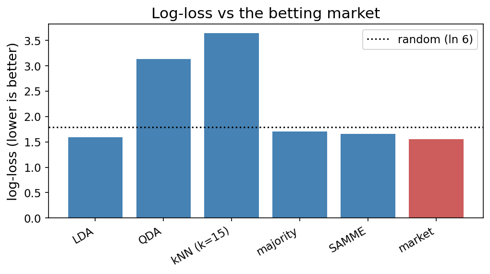

**Dimensionality reduction.** PCA does not rescue the weaker models. The variance is spread out (50 of the 114 components are needed for 90%, so there is no compact low-dimensional structure), and at their best PCA dimension QDA reaches 0.566 and kNN 0.562 winner accuracy, neither beating LDA's 0.626.

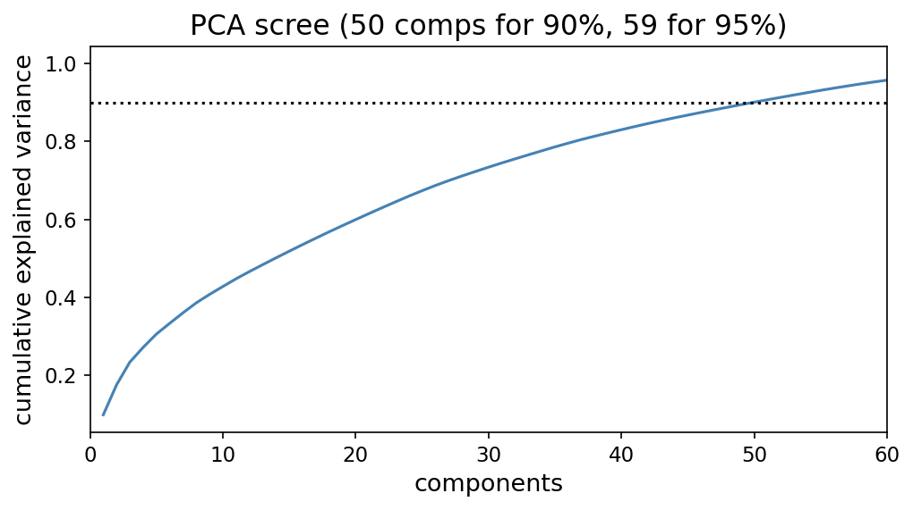

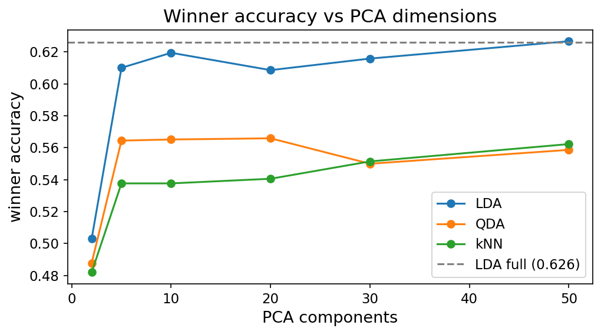

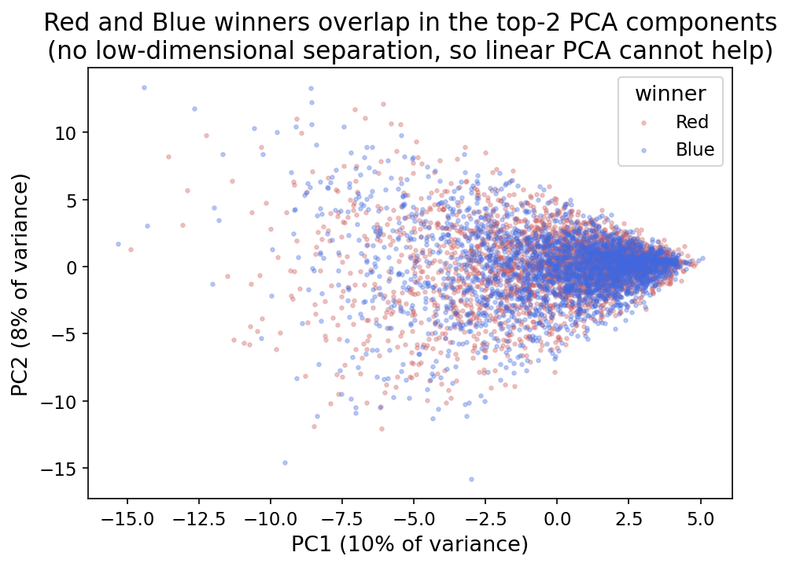

The kNN k-sweep completes the hyperparameter analysis: 6-class accuracy is noisy at small k (high variance) and plateaus around k=15, the value used in the baseline panel, with no gain from more neighbours.

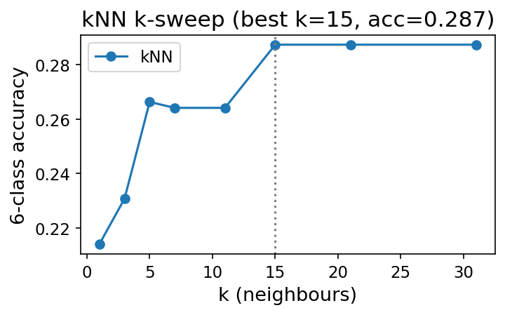

## 8. Analysis and discussion

**Does the extension beat the baselines, and is the complexity worth it?** No. SAMME reaches 0.633 winner accuracy and LDA 0.626, a gap smaller than the seed-to-seed variation, so a 200-stump boosting ensemble and a single linear discriminant perform equally. The natural reading is that the relationship between the pre-fight difference features and the outcome is close to linear: there is little non-linear structure for boosting to exploit, so its extra capacity does not translate into accuracy. For this problem the simpler model is preferable on every axis except, marginally, probability calibration.

The decision-region plots below illustrate why: re-fit on just two features each, all four models sit in a heavily mixed region where Red and Blue winners overlap almost completely. LDA draws a straight boundary, QDA a gentle curve, kNN ragged local pockets, and SAMME axis-aligned boxes from its stumps - but no family carves out clean separation, which is why winner accuracy stays near the ceiling regardless of model.


**Does dimensionality reduction help?** Also no, and informatively so. The PCA scree curve is flat: it takes 50 of the 114 components to capture 90% of the variance, so there is no compact low-dimensional structure to recover. Reducing to a PCA subspace leaves QDA essentially unchanged (0.566 against 0.567 at full dimension) and improves kNN only marginally (0.562 against 0.550), and neither approaches LDA. The weakness of QDA and kNN is not a conditioning problem that DR can fix; it is that their inductive biases (per-class covariance, local neighbourhoods) do not suit data whose signal is spread thinly and roughly linearly across many features.

**How close are we to the ceiling and the market?** Our winner accuracy of about 0.63 sits inside the published 63-67% range, and against the de-vigged betting market we reach a log-loss of 1.66 versus the market's 1.55. The market remains the stronger forecaster, but the gap is small. We approach but do not beat the practical ceiling, which is the expected outcome: the market aggregates sharp money and information we do not have.

**What predicts how a fight ends?** Method of victory is harder than the winner: method accuracy hovers around 0.50, and the confusion matrix shows the models concentrate on the common decision outcomes, recovering knockouts and especially submissions less often. The class imbalance (decisions are by far the largest class) and the inherent unpredictability of finishes both contribute.

**Where prediction works better.** The single accuracy figure hides real variation across divisions. Broken down by weight class, winner accuracy ranges from about 0.73 in welterweight to about 0.55 in flyweight, an eighteen-point spread. Crucially, this variation does not track weight in any clean way: the correlation between a division's weight and its accuracy is only about +0.31 across the nine divisions, weak and not significant given so few points. The heaviest division (heavyweight) sits mid-table, the lightest (flyweight) is lowest, and the middle divisions span the whole range (welterweight highest, middleweight low). The per-division estimates are noisy (several divisions have only about 50 to 100 test fights), so we report the spread as a real but largely unexplained effect.

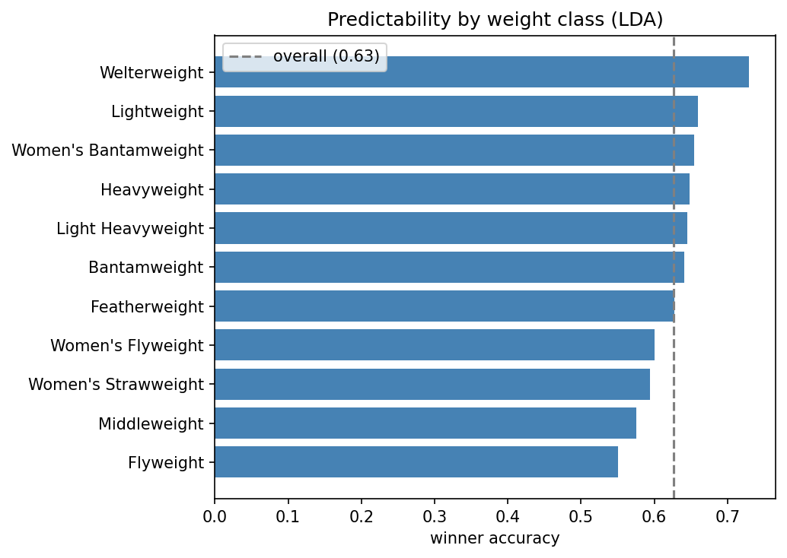

**Errors and limitations.** The headline limitation is the low ceiling itself: a single clean strike can end a fight, so a large share of the outcome is irreducible variance no pre-fight model can capture. Others: the six-class target is imbalanced; symmetrization deliberately removes the corner prior, which costs a little on the original-corner test but buys methodological honesty; and the debut indicator we tried added nothing. None of these are fatal, and several of our choices (the confound control, the leakage audit, the market benchmark) are exactly the rigour that distinguishes the study.

## 9. Conclusions

We set out to see how close a fully from-scratch pipeline could get to the practical ceiling on UFC outcome prediction. On a chronological test set, our best models reach about 63% winner-prediction accuracy and about 0.35 accuracy on the harder six-class winner-and-method target, beating the always-favourite and always-red references and landing inside the published 63-67% ceiling. The boosting extension (SAMME) matches but does not beat a simple linear discriminant, and the de-vigged betting market still edges both on log-loss (1.55 against our 1.66). Two findings stand out: the red-corner advantage is a selection effect rather than a real edge, and the signal in the pre-fight difference features is close to linear, so the added complexity of an ensemble buys little here. Beyond the headline, two further findings give the result more shape: recent form, grappling, and experience (win streaks, takedown rates, rounds fought) carry more signal than the often-cited reach and age, and predictability varies sharply by division (from about 0.73 in welterweight to about 0.55 in flyweight) without tracking weight in any clean way. The contribution of this project is therefore less a single best model than a careful map of how far pre-fight data can take outcome prediction on this problem, together with the methodology that makes the map trustworthy: a leakage audit, the controlled red-corner analysis, and a benchmark against the betting market. In short, we get near the ceiling, which is the realistic target in a sport with this much irreducible variance.

**Future work.** The clearest direction is to enrich the feature set with information our dataset simply does not carry. ufcstats and its derivatives describe *what* fighters did in the cage but say almost nothing about *who* they are - in particular **nationality, gym/team and martial-arts base** are absent. These map onto some of the sport's most discussed narratives (the Dagestani wrestling pipeline, the Brazilian jiu-jitsu lineage, and so on), and testing whether such background actually carries predictive signal would be a genuinely interesting study. Doing it properly would mean **building a new dataset**: scraping bios from sources like Tapology or Sherdog and joining them onto the ufcstats fight records, effectively stitching multiple sources into one - which is why we scoped it out of this project rather than attempting it under a deadline.

Other framings we discussed and set aside, each able to stand as its own project, include: a **regression** target (predicting fight duration, significant strikes landed, or control time - the only framing that would exercise a linear-regression baseline); **finish vs. decision** ("does the fight go the distance?") and **round of finish** as alternative classification targets; **fight-type clustering** (grappling- vs. striking-heavy bouts); a dedicated **scorecard / judging** model (JudgeAI-style, which would need komaksym's parsed scorecards); **upset detection**; and the fighter **style-clustering** study mentioned in Section 1.1.

A further refinement we did not pursue is **cost-sensitive learning**. The six classes are not equally costly to confuse: mistaking `Red-KO` for `Red-DEC` still gets the winner right, whereas mistaking `Red-DEC` for `Blue-DEC` does not. A cost matrix that gives partial credit for a correct winner but wrong method, applied either at decision time via Bayes risk over the predicted probabilities or baked into the boosting objective (AdaCost-style), could trade a little method accuracy for better winner accuracy and is a natural next step given our joint target.

## References

The brief requires a reference only for the extension method; the baseline methods are covered in the course (see Section 5.1) and are not listed here. References 1 and 2 cover the extension; 3 to 7 are domain and related work.

1. <a id="ref-1"></a>Zhu, J., Zou, H., Rosset, S. & Hastie, T. (2009). *Multi-class AdaBoost.* Statistics and Its Interface, 2(3), 349-360. https://doi.org/10.4310/SII.2009.v2.n3.a8
2. <a id="ref-2"></a>Freund, Y. & Schapire, R. E. (1997). *A decision-theoretic generalization of on-line learning and an application to boosting.* Journal of Computer and System Sciences, 55(1), 119-139. https://doi.org/10.1006/jcss.1997.1504
3. <a id="ref-3"></a>*Artificial Intelligence in UFC Outcome Prediction and Fighter Strategies Optimization* (2024). Proc. 9th Intl. Conf. on Intelligent Information Processing (ACM). https://dl.acm.org/doi/10.1145/3696952.3696966
4. <a id="ref-4"></a>Rami Genauer, FightMetric founder, speaker bio, MIT Sloan Sports Analytics Conference. https://www.sloansportsconference.com/people/rami-genauer
5. <a id="ref-5"></a>mmamodel.ai, methodology writeup on the ~65% winner-prediction ceiling and the betting market as benchmark. https://mmamodel.ai/methodology/
6. <a id="ref-6"></a>*Prediction of UFC Lightweight Winners Using Ensemble Machine Learning* (2024). ResearchGate. https://www.researchgate.net/publication/403503222
7. <a id="ref-7"></a>Kuhn, R. *Fightnomics*, book-length statistical analysis of MMA. Archived: https://web.archive.org/web/20191017131432/http://fightnomics.com/

## Appendix

**Repository layout.**

```
src/baselines/      LDA, QDA, kNN, PCA, majority classifier (from scratch, validated vs sklearn)
src/extension/      SAMME multiclass AdaBoost (from scratch, validated vs sklearn on Iris)
src/data/           load+label, feature engineering, corner symmetrization, chronological split,
                    train-only scaling/imputation, betting-odds benchmark
src/metrics.py      evaluation metrics (accuracy, F1, ROC-AUC, log-loss, Brier, confusion matrix)
src/plotting.py     figure helpers (save_fig, plot_confusion_matrix, plot_decision_regions, …)
notebooks/          01_eda.ipynb  02_baselines.ipynb  03_extension.ipynb  04_results.ipynb
tests/              unit/ (per-class unit tests) + validate_baselines.py (integration runner)
data/raw/           mdabbert ufc-master.csv (gitignored; download from Kaggle)
report/figures/     all figures embedded in this document
report/             this report + per-notebook result CSVs (results_baselines.csv, etc.)
docs/               PROPOSAL.md  TODO.md  DATASETS.md  SOURCES.md
```

**How to reproduce.** Install dependencies (`pip install -r requirements.txt`), place `ufc-master.csv` in `data/raw/mdabbert/`, then run the notebooks in order: `01_eda` → `02_baselines` → `03_extension` → `04_results`. The notebooks write result CSVs to `report/` and figures to `report/figures/`; `04_results` reads those CSVs rather than refitting models, so it runs in seconds.

**Sklearn validation summary.** The integration runner (`tests/validate_baselines.py`) checks LDA, QDA, kNN, and SAMME predictions and probabilities against scikit-learn reference implementations on held-out data. All 44 checks pass. Individual unit tests live in `tests/unit/`.
